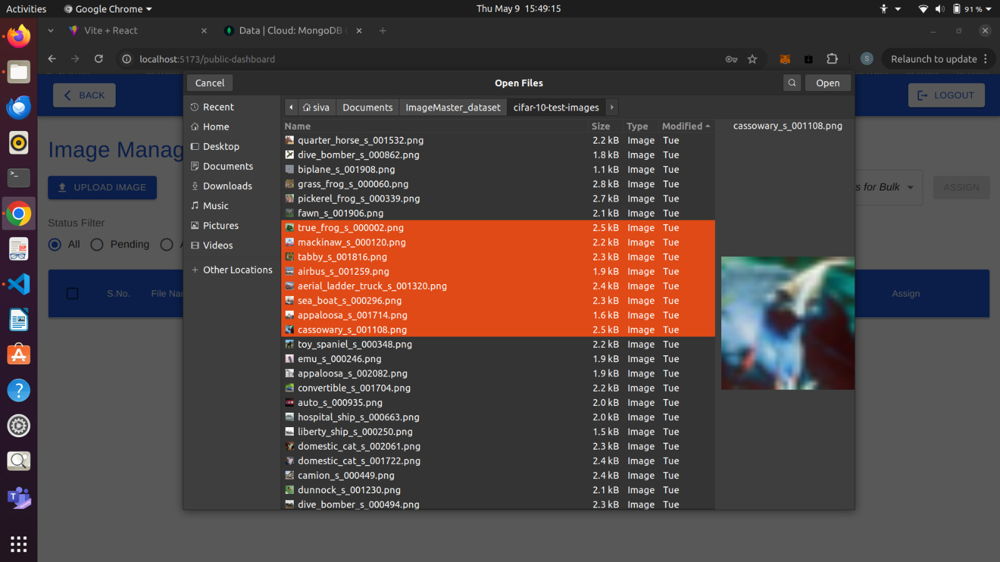
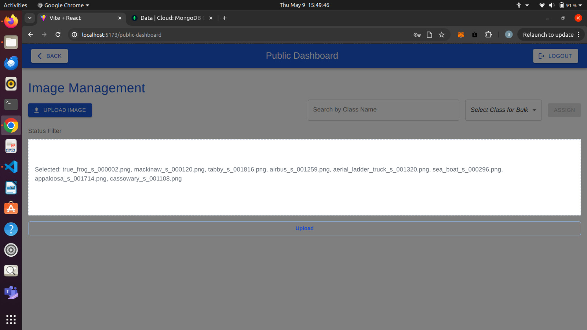

# Image Master

# Components:

## 1. Register Page:

The user has to enter basic details like username, email, password etc. The following Error cases are properly handled. 
- User emails will be unique.
- Basic validation checks are handled.

## 2. Sign-In Page:

The user can sign in as either normal user role or admin role with the registered email address. 

## 3. Home Page (Mode Selection Page):

The user after successfully logging in, can choose to join either a public or private channel to annotate images.

## 4. Classes Management Page:

- The admin can create new domains. He can create and add new classes under those domains.

- Admins can delete the domains or clases created by him/her.

- User can only annotate with an existing class that has already been created by the admin.

## 5. Public Dashboard:

- The list of all the images with their status (annotated or not) and annotator (the person who annotated the image) is displayed in this page.

- User can select a filter to view only annotated images or pending images.

- User can search for images by class name.

- User can upload new images into the public dashboard page. Multiple images can be uploaded at once.

- User can edit the status of annotation to the images that are previously annotated by him/her. 
- User will not be able to edit the annotation of the images annotated by another user.
- The information of all the annotated images can be downloaded as a txt file.
- Users can select multiple images at a time to assign a class to all of them.

## 5. Private Dashboard:

- The list of all the images that are owned by the user are displayed on this page. No user will be able to view the private dashboard of another user.

- User can select a filter to view only annotated images or pending images.

- Users can select multiple images at a time to assign a class to all of them.

- User can upload new images into the public dashboard page. Multiple images can be uploaded at once.

# Dockerized The Application:

## Installation:

- 1. Go to Root directory after cloning the repository (ImageMaster)
- 2. Run command `docker compose up --build` in terminal
- 3. Server will run at localhost 5000, minio at 9001 and frontend at 5173
- 4. Then use the application at `http://localhost:5173`.

### Without Docker Installation:

- 1. Clone the repository, install all dependency packages using `npm install` in both client and server folders.
- 2. Run `minio server ./images` to connect to minio client.
- 3. Run server using `nodemon index.js` and run client using `npm start`.

# Dataset Used:

- For image functionality testing purpose, I used CIFAR 10 test images.

# Demo Video:

- See the demo of Application here [Click](https://drive.google.com/file/d/1yMRTkI-QryeJkEmBfiFzh8pM9TVG_-8r/view?usp=drivesdk)